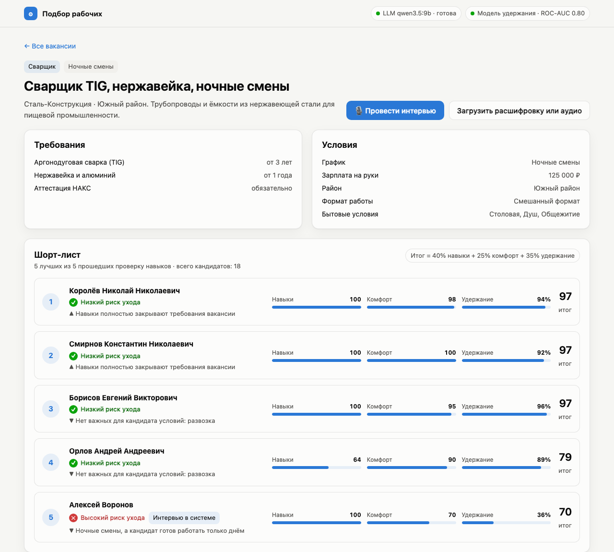

<p align="center">
  Подбор промышленных рабочих: ИИ-интервью, проверка навыков по цитатам из ответов кандидата и шорт-лист по двум осям - навыки и комфорт - с прогнозом удержания на 90 дней. LLM и распознавание речи работают локально.
</p>

<p align="center">
  
  
  
  
  
  
</p>

<p align="center">
  
</p>

## Возможности

- **Интервью по сценарию вакансии.** Отдельный вопрос на каждый обязательный навык и удостоверение, затем вопросы о графике, дороге, зарплате, бытовых условиях, формате работы и сменах мест работы. Вопросы озвучиваются голосом браузера.
- **Загрузка готового интервью.** Расшифровка (`.txt`, `.md`) или аудиозапись (`.mp3`, `.m4a`, `.wav` и др.), аудио расшифровывает faster-whisper.
- **Проверка навыков по цитатам.** LLM возвращает профиль по JSON-схеме со списком допустимых навыков, поэтому выдумать новый навык она не может. Навык засчитывается, только если цитата-подтверждение найдена в репликах кандидата и относится к этому навыку.
- **Две оси сопоставления.** "Навыки" - стаж и удостоверения против требований вакансии. "Комфорт" - смены, дорога, зарплата, бытовые условия и формат работы.
- **Прогноз удержания.** CatBoost оценивает вероятность проработать 90 дней для пары кандидат-вакансия, SHAP раскладывает прогноз на факторы в процентных пунктах.
- **Шорт-лист.** Пять лучших из кандидатов, прошедших проверку навыков. Итог = 40% навыки + 25% комфорт + 35% удержание.

<p align="center">
  
</p>

## Требования

- [uv](https://docs.astral.sh/uv/) (Python 3.11 ставится автоматически)
- [Ollama](https://ollama.com) и около 7 ГБ под модель `qwen3.5:9b`
- около 1.6 ГБ под модель распознавания речи `large-v3-turbo`

## Установка

```bash
git clone https://github.com/TihonSotnikov/Worker-Selection-App.git
cd Worker-Selection-App
make setup
```

`make setup` ставит зависимости Python, скачивает LLM в Ollama (Ollama должна быть запущена) и модель faster-whisper.

## Использование

```bash
make run
```

Интерфейс: http://127.0.0.1:8000, OpenAPI: http://127.0.0.1:8000/docs.

При первом запуске создаётся SQLite-база с 6 демо-вакансиями и 48 синтетическими кандидатами, а модель удержания обучается на 6000 синтетических парах. Всё хранится в `data/`, `make reset` сбрасывает базу и модель.

Для проверки загрузки в `examples/` лежат три расшифровки интервью и аудиозапись.

## Настройка

Параметры задаются переменными окружения или в `.env`, пример - `.env.example`:

| Переменная | По умолчанию | Назначение |
|---|---|---|
| `LLM_BASE_URL` | `http://127.0.0.1:11434` | адрес Ollama |
| `LLM_MODEL` | `qwen3.5:9b` | модель в Ollama |
| `LLM_TIMEOUT` | `300` | таймаут запроса к LLM, с |
| `STT_MODEL` | `large-v3-turbo` | модель faster-whisper |
| `DATA_DIR` | `data` | база, модель удержания |
| `ML_TRAIN_ROWS` | `6000` | размер синтетической выборки |

## Архитектура

```text
app/
├── ai/         # клиент Ollama, извлечение профиля, сценарий интервью, STT
├── api/        # REST-маршруты, SQLModel-таблицы
├── core/       # конфигурация, справочники навыков и удостоверений, схемы
├── ml/         # генератор синтетики, признаки пары, модель удержания
├── services/   # интервью, сопоставление, хранение, демо-данные
└── frontend/   # SPA на чистом JavaScript
```

- **Извлечение.** Ответ Ollama ограничен JSON-схемой, сломанный JSON исключён. Цитаты сверяются с репликами кандидата по словам, удостоверения с отрицанием ("корочек нет") отбрасываются.
- **Удержание.** Синтетические исходы задаются скрытыми правилами поверх признаков пары, модель их восстанавливает: ROC-AUC 0.80 на отложенных 20% синтетики. На все признаки наложены монотонные ограничения: например, частая смена работы не может повышать прогноз.
- **Производительность.** На Apple M1 Pro 16 ГБ разбор интервью через `qwen3.5:9b` занимает 20-35 с, расшифровка 75 с аудио на CPU - около 12 с.

## Тестирование

```bash
make test
make lint
```

Тесты не требуют Ollama: LLM подменяется заглушкой. CI в GitHub Actions запускает ruff, pytest и сборку Docker-образа.
