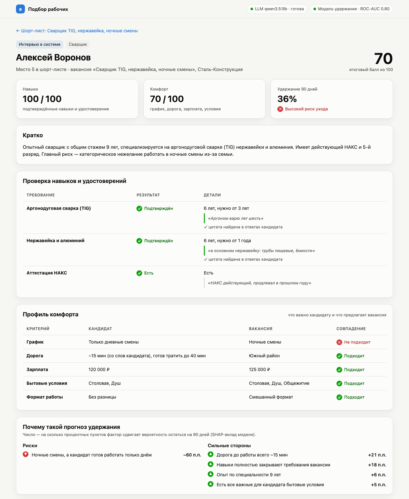

# Worker Selection App

ИИ-платформа подбора промышленных рабочих: станочников, сварщиков, электромехаников.
Система проводит интервью, проверяет навыки по цитатам из ответов кандидата и собирает
для рекрутера шорт-лист по двум осям — **навыки** и **комфорт** — с прогнозом, что человек
не уйдёт в первые 90 дней.

Всё работает локально на Mac: LLM через [Ollama](https://ollama.com), без облачных API.




## Что умеет

| Требование ТЗ | Как сделано |
|---|---|
| Голосовое интервью (в симуляции — текст с пометкой «голос») | Чат-интервью по сценарию вакансии, вопросы озвучиваются. Можно загрузить готовую расшифровку или аудиозапись |
| Проверка ≥ 2 профессиональных навыков | На каждый обязательный навык свой вопрос. LLM извлекает стаж и **дословную цитату**. Навык засчитывается, только если цитата действительно есть в ответах |
| Сбор 3+ «мягких» критериев | График и отношение к ночным сменам, дорога, зарплата, бытовые условия, бригада или работа в одиночку, смены работы |
| Ранжирование по двум осям + прогноз удержания | Навыки и комфорт + CatBoost-прогноз удержания на 90 дней с объяснением причин (SHAP) |
| Шорт-лист 3–5 кандидатов с отчётом | Топ-5 с подтверждёнными навыками, профилем комфорта, рисками и тем, что стоит уточнить |

## Быстрый старт (macOS)

```bash
brew install ollama uv
brew services start ollama
make setup   # зависимости Python, qwen3.5:9b (~6.6 ГБ) и модель распознавания речи (~1.6 ГБ)
make run     # http://127.0.0.1:8000
```

При первом запуске создаются база с демо-данными (6 вакансий, 48 синтетических кандидатов)
и обучается модель удержания — это занимает пару секунд.

Шорт-листы, отчёты и график работают и без LLM. Модель нужна только для разбора интервью
и загруженных расшифровок. Статус LLM виден в правом верхнем углу.

## Сценарий демо (5 минут)

1. **Главная.** Вакансии и блок «Что выучила модель удержания». Типичный кандидат остаётся
   на 90 дней с вероятностью ~86%. Если он не готов к ночным сменам, а вакансия ночная, — ~23%.
   Это правило из ТЗ, модель выучила его из данных.
2. **Вакансия «Сварщик TIG, ночные смены».** Шорт-лист, график «навыки × комфорт», таблица
   всех кандидатов и причина, почему человек не попал в шорт-лист.
3. **Отчёт по кандидату.** Проверка навыков с цитатами, профиль комфорта против условий
   вакансии, факторы риска и сильные стороны в процентных пунктах.
4. **«Провести интервью».** Ответить на 9 вопросов, например сказать, что ночью работать
   не можете. После «Завершить» модель разбирает ответы, и кандидат появляется в шорт-листе
   с риском «ночные смены, а кандидат готов работать только днём».
5. **«Загрузить расшифровку или аудио».** Примеры из [`examples/`](./examples) дают три разных исхода:
   - `candidate1.txt` или `candidate1_audio.m4a` → «Оператор фрезерного ЧПУ»: Дмитрий попадает
     в шорт-лист, удержание ~88%;
   - `candidate2.txt` → «Сварщик-полуавтоматчик»: Максим отсеян, удержание ~1% — дорога 2,5 часа
     и 5 смен работы за 5 лет;
   - `candidate3.txt` → «Электромеханик»: Сергей Петрович отсеян — гидравлика не подтверждена,
     группа допуска просрочена, предпочитает работать один.

## Как это устроено

```
Интервью / файл ─► STT (faster-whisper) ─► LLM (Ollama, JSON-схема) ─► проверка цитат ─► профиль кандидата
                                                                                               │
Вакансия ───────────────────────────────────────────────────────────────────────────────────────┤
                                                                                               ▼
                          признаки пары «кандидат × вакансия» ─► навыки · комфорт · удержание (CatBoost + SHAP)
                                                                                               │
                                                                                               ▼
                                                                          шорт-лист и отчёт рекрутеру
```

**Извлечение (LLM).** Модель получает расшифровку и JSON-схему, в которой перечислены
допустимые навыки, районы и значения. Ollama ограничивает генерацию этой схемой,
поэтому сломанный JSON или «придуманный» навык невозможны. Затем каждая цитата
сверяется с репликами кандидата: цитата, которой в ответах нет, навык не подтверждает.

**Ось «Навыки»** (0–100): по каждому обязательному навыку — стаж против требуемого и
подтверждение цитатой (75%), удостоверения — разряд, НАКС, группа по электробезопасности (25%).
Кто не подтвердил обязательный навык, в шорт-лист не попадает.

**Ось «Комфорт»** (0–100): график (30%), дорога (25%), зарплата (25%), бытовые условия (10%),
формат работы (10%).

**Удержание** — вероятность проработать 90 дней. CatBoost на 9 признаках **пары**
кандидат × вакансия: конфликт графика, время в пути и превышение допустимого, разница
зарплаты и ожиданий, покрытие навыков, недостающие бытовые условия, несовпадение
формата работы, стаж, частота смены работы. На признаки наложены ограничения
монотонности, поэтому объяснения не противоречат здравому смыслу. SHAP-вклады
переводятся в процентные пункты: «ночные смены → −52 п.п.».

**Итоговый балл** = 40% навыки + 25% комфорт + 35% удержание.

**Чего модель намеренно не видит:** возраст, пол, семейное положение, наличие детей.
Отказ по этим признакам — дискриминация (ст. 64 ТК РФ), поэтому модель смотрит только
на то, что касается работы и условий.

### Данные

Все компании, кандидаты и персональные данные синтетические. Исход «остался / ушёл»
задаётся скрытыми правилами в `app/ml/generator.py`, а модель учится восстанавливать их
по признакам. ROC-AUC ≈ 0.80 на отложенной синтетической выборке: это проверка того,
что конвейер работает, а не обещание точности на реальных людях.

### Выбор локальной LLM

Кандидаты — модели до ~10B параметров, которые помещаются в 16 ГБ общей памяти Mac
(M1 Pro) вместе с приложением и браузером. Обе прогнаны на трёх расшифровках из `examples/`:

| | **Qwen3.5-9B** (`qwen3.5:9b`) | GigaChat 3.1 Lightning (10B MoE) |
|---|---|---|
| Время на интервью, M1 Pro | 19–31 с | 15–34 с |
| Имена кандидатов | извлекла все | не извлекла ни одного |
| Выдуманные факты | единичные, отсекаются проверкой цитат | удостоверение НАКС по цитате про стойку ЧПУ, зарплата, район, столовая и душ у всех троих |
| Цитаты | дословные | часто пересказ или название навыка |

По умолчанию стоит **Qwen3.5-9B**: для рекрутера точность фактов важнее полноты. Модель
меняется через `LLM_MODEL` в `.env`.

Слабые места маленькой модели закрыты правилами поверх LLM:
- цитата должна быть в ответах кандидата и называть навык («электрик, киповец» не
  подтверждает «гидравлику»);
- удостоверения с отрицанием («стропального нет») отбрасываются;
- разряд, упомянутый вскользь, подхватывается регулярным выражением, если модель его пропустила.

## Настройки

Скопируйте `.env.example` в `.env`. Основное:

| Переменная | По умолчанию | Что это |
|---|---|---|
| `LLM_MODEL` | `qwen3.5:9b` | модель в Ollama |
| `LLM_BASE_URL` | `http://127.0.0.1:11434` | адрес Ollama |
| `STT_MODEL` | `large-v3-turbo` | модель faster-whisper (скачается при первой загрузке аудио) |
| `DATA_DIR` | `data/` | SQLite-база и обученная модель удержания |
| `DATABASE_URL` | SQLite в `DATA_DIR` | строка подключения SQLAlchemy |

`make reset` удаляет базу и модель — при следующем запуске они создадутся заново.

## Структура

```
app/
├── ai/          # Ollama-клиент, извлечение профиля + проверка цитат, сценарий интервью, STT
├── api/         # FastAPI-роуты, таблицы и сессии БД
├── core/        # настройки, справочники (навыки, районы, условия), схемы, enum'ы
├── ml/          # признаки пары, генератор синтетики, модель удержания (CatBoost + SHAP)
├── services/    # сопоставление и шорт-лист, интервью, загрузка файлов, хранилище, демо-данные
└── frontend/    # SPA на чистом JS: вакансии, шорт-лист, отчёт, интервью
examples/        # расшифровки интервью и аудио для демо
tests/           # pytest: сопоставление, ML, извлечение, API (LLM подменяется)
```

## Разработка

```bash
make test     # 33 теста, ~3 с, без LLM и сети
make lint     # ruff check + format --check
make format
```

CI (GitHub Actions) запускает линтер, тесты и сборку Docker-образа.

## Docker

```bash
make docker-build
docker run -p 8000:8000 -v "$PWD/data:/app/data" worker-selection-app
```

LLM остаётся на хосте в Ollama, контейнер обращается к ней по `host.docker.internal`.

## Дальше

Что не вошло в MVP и что планируется — в [PLAN.md](./PLAN.md). ТЗ — в [описание_задачи.md](./описание_задачи.md).
